# Execution Plan — Meedok-chat

**Generated**: 2026-06-24  
**Project Type**: Greenfield  
**Risk Level**: Medium-High  

---

## Detailed Analysis Summary

### Change Impact Assessment

| Impact Area | Present | Description |
|-------------|---------|-------------|
| User-facing changes | Yes | Brand-new React frontend for doctors — chatbot UI, streaming response rendering |
| Structural changes | Yes | New system from scratch — multi-tenant architecture, auth service, AI integration |
| Data model changes | Yes | New schemas: patients, diagnoses, chat sessions, prescriptions (model only), tenants, doctors |
| API changes | Yes | New REST API (OpenAPI-described) — auth, chatbot, patient data endpoints |
| NFR impact | Yes | Streaming latency (≤3s first token), ≥50 concurrent users, ISO 27001 intent, 3 extensions enabled |

### Risk Assessment

| Factor | Assessment |
|--------|------------|
| Risk Level | **Medium-High** |
| Drivers | Multi-tenant isolation (critical failure mode), AWS Bedrock streaming integration, medical data sensitivity, prompt injection attack surface |
| Rollback Complexity | Low (greenfield — nothing to break in production) |
| Testing Complexity | Moderate-to-complex — multi-tenant isolation tests, streaming SSE tests, PBT for data transforms |

---

## Workflow Visualization

```mermaid
flowchart TD
    Start(["User Request"])

    subgraph INCEPTION["🔵 INCEPTION PHASE"]
        WD["Workspace Detection\nCOMPLETED"]
        RE["Reverse Engineering\nSKIPPED - Greenfield"]
        RA["Requirements Analysis\nCOMPLETED"]
        US["User Stories\nSKIPPED"]
        WP["Workflow Planning\nIN PROGRESS"]
        AD["Application Design\nEXECUTE"]
        UG["Units Generation\nEXECUTE"]
    end

    subgraph CONSTRUCTION["🟢 CONSTRUCTION PHASE"]
        FD["Functional Design\nEXECUTE - per unit"]
        NFRA["NFR Requirements\nEXECUTE - per unit"]
        NFRD["NFR Design\nEXECUTE - per unit"]
        ID["Infrastructure Design\nEXECUTE - per unit"]
        CG["Code Generation\nEXECUTE - per unit"]
        BT["Build and Test\nEXECUTE"]
    end

    subgraph OPERATIONS["🟡 OPERATIONS PHASE"]
        OPS["Operations\nPLACEHOLDER"]
    end

    Start --> WD
    WD --> RE
    RE --> RA
    RA --> US
    US --> WP
    WP --> AD
    AD --> UG
    UG --> FD
    FD --> NFRA
    NFRA --> NFRD
    NFRD --> ID
    ID --> CG
    CG -->|"next unit"| FD
    CG --> BT
    BT --> OPS
    OPS --> End(["Complete"])

    style WD fill:#4CAF50,stroke:#1B5E20,stroke-width:3px,color:#fff
    style RA fill:#4CAF50,stroke:#1B5E20,stroke-width:3px,color:#fff
    style WP fill:#4CAF50,stroke:#1B5E20,stroke-width:3px,color:#fff
    style CG fill:#4CAF50,stroke:#1B5E20,stroke-width:3px,color:#fff
    style BT fill:#4CAF50,stroke:#1B5E20,stroke-width:3px,color:#fff
    style RE fill:#BDBDBD,stroke:#424242,stroke-width:2px,stroke-dasharray:5 5,color:#000
    style US fill:#BDBDBD,stroke:#424242,stroke-width:2px,stroke-dasharray:5 5,color:#000
    style AD fill:#FFA726,stroke:#E65100,stroke-width:3px,stroke-dasharray:5 5,color:#000
    style UG fill:#FFA726,stroke:#E65100,stroke-width:3px,stroke-dasharray:5 5,color:#000
    style FD fill:#FFA726,stroke:#E65100,stroke-width:3px,stroke-dasharray:5 5,color:#000
    style NFRA fill:#FFA726,stroke:#E65100,stroke-width:3px,stroke-dasharray:5 5,color:#000
    style NFRD fill:#FFA726,stroke:#E65100,stroke-width:3px,stroke-dasharray:5 5,color:#000
    style ID fill:#FFA726,stroke:#E65100,stroke-width:3px,stroke-dasharray:5 5,color:#000
    style OPS fill:#FFF59D,stroke:#F57F17,stroke-width:2px,stroke-dasharray:5 5,color:#000
    style Start fill:#CE93D8,stroke:#6A1B9A,stroke-width:3px,color:#000
    style End fill:#CE93D8,stroke:#6A1B9A,stroke-width:3px,color:#000
    style INCEPTION fill:#BBDEFB,stroke:#1565C0,stroke-width:3px,color:#000
    style CONSTRUCTION fill:#C8E6C9,stroke:#2E7D32,stroke-width:3px,color:#000
    style OPERATIONS fill:#FFF59D,stroke:#F57F17,stroke-width:3px,color:#000

    linkStyle default stroke:#333,stroke-width:2px
```



### Text Alternative

```
INCEPTION PHASE
  [x] Workspace Detection     — COMPLETED
  [-] Reverse Engineering     — SKIPPED (Greenfield)
  [x] Requirements Analysis   — COMPLETED
  [-] User Stories            — SKIPPED (single user type, clear requirements)
  [>] Workflow Planning       — IN PROGRESS
  [ ] Application Design      — EXECUTE
  [ ] Units Generation        — EXECUTE

CONSTRUCTION PHASE (per-unit loop)
  [ ] Functional Design       — EXECUTE (per unit)
  [ ] NFR Requirements        — EXECUTE (per unit)
  [ ] NFR Design              — EXECUTE (per unit)
  [ ] Infrastructure Design   — EXECUTE (per unit)
  [ ] Code Generation         — EXECUTE (per unit, always)
  [ ] Build and Test          — EXECUTE (always, after all units)

OPERATIONS PHASE
  [ ] Operations              — PLACEHOLDER
```

---

## Phases to Execute

### 🔵 INCEPTION PHASE

- [x] **Workspace Detection** — COMPLETED
  - Greenfield confirmed, no prior codebase

- [-] **Reverse Engineering** — SKIPPED
  - Rationale: Greenfield project, no existing code to analyse

- [x] **Requirements Analysis** — COMPLETED
  - 8 open questions resolved, 2 contradictions resolved, requirements.md generated

- [-] **User Stories** — SKIPPED
  - Rationale: Single user type (Doctor), requirements are clear and complete, no multiple personas or complex acceptance criteria workflow needed. Can be added on request.

- [>] **Workflow Planning** — IN PROGRESS (this document)

- [ ] **Application Design** — EXECUTE
  - Rationale: Brand-new system with multiple new components needing identification and service layer definition. Components include: auth service, chatbot API, AI integration layer, patient data service, React frontend, CDK infrastructure. Component methods, interfaces, and dependencies must be designed before unit decomposition.

- [ ] **Units Generation** — EXECUTE
  - Rationale: Multiple distinct workstreams (auth, chatbot backend, patient data, frontend, infrastructure) that can be developed in parallel. Units decomposition ensures each can be designed, coded, and tested independently.

### 🟢 CONSTRUCTION PHASE (per-unit loop)

- [ ] **Functional Design** — EXECUTE per unit
  - Rationale: New data models (patients, diagnoses, chat sessions, prescriptions schema, tenants), complex business logic (prompt construction, streaming pipeline, multi-tenant query isolation), business rules for AI disclaimer and confirmation flow.

- [ ] **NFR Requirements** — EXECUTE per unit
  - Rationale: Streaming latency requirement (≤3s first token), scalability (≥50 concurrent), security (ISO 27001 intent), three extensions enabled (Security Baseline, Resiliency Baseline, PBT) — all require NFR assessment per unit.

- [ ] **NFR Design** — EXECUTE per unit
  - Rationale: NFR Requirements will be executed; patterns (circuit breaker for Bedrock calls, rate limiting, structured logging, PBT test harness) must be incorporated into the design before code generation.

- [ ] **Infrastructure Design** — EXECUTE per unit
  - Rationale: AWS CDK (TypeScript) chosen for IaC; EC2 deployment, AWS Bedrock, AWS S3, load balancer, VPC configuration — all cloud resources need specification and mapping before code generation.

- [ ] **Code Generation** — EXECUTE per unit (always)
  - Rationale: Core implementation stage — generates all application code, tests, and CDK infrastructure.

- [ ] **Build and Test** — EXECUTE (always, after all units)
  - Rationale: Comprehensive build instructions, unit tests (≥70% Jest), integration tests (multi-tenant isolation, streaming), PBT tests.

### 🟡 OPERATIONS PHASE

- [ ] **Operations** — PLACEHOLDER
  - Rationale: Future deployment and monitoring workflows not yet defined in AI-DLC.

---

## Estimated Unit Breakdown (preliminary — confirmed in Units Generation)

| Unit | Description |
|------|-------------|
| `auth` | JWT auth service — token issuance, validation, refresh, tenant scoping |
| `patient-data` | Patient records, diagnosis history, prescription schema (read layer) |
| `chatbot-api` | Diagnosis chatbot backend — prompt construction, Bedrock streaming, session persistence |
| `frontend` | React UI — chatbot interface, streaming rendering, doctor dashboard |
| `infrastructure` | AWS CDK stack — EC2, VPC, load balancer, S3, Bedrock IAM, environment config |

---

## Success Criteria

| Metric | Target |
|--------|--------|
| Primary goal | Working diagnosis chatbot delivering AI-assisted summaries to doctors |
| Consultation time KPI | 20% reduction in average consultation time (raw data captured from day 1) |
| Streaming latency | First token ≤ 3s (P95) |
| Test coverage | ≥ 70% Jest unit coverage |
| Multi-tenant isolation | Zero cross-tenant data leaks — validated by automated isolation tests |
| Security | Security Baseline extension passing at every construction stage |
